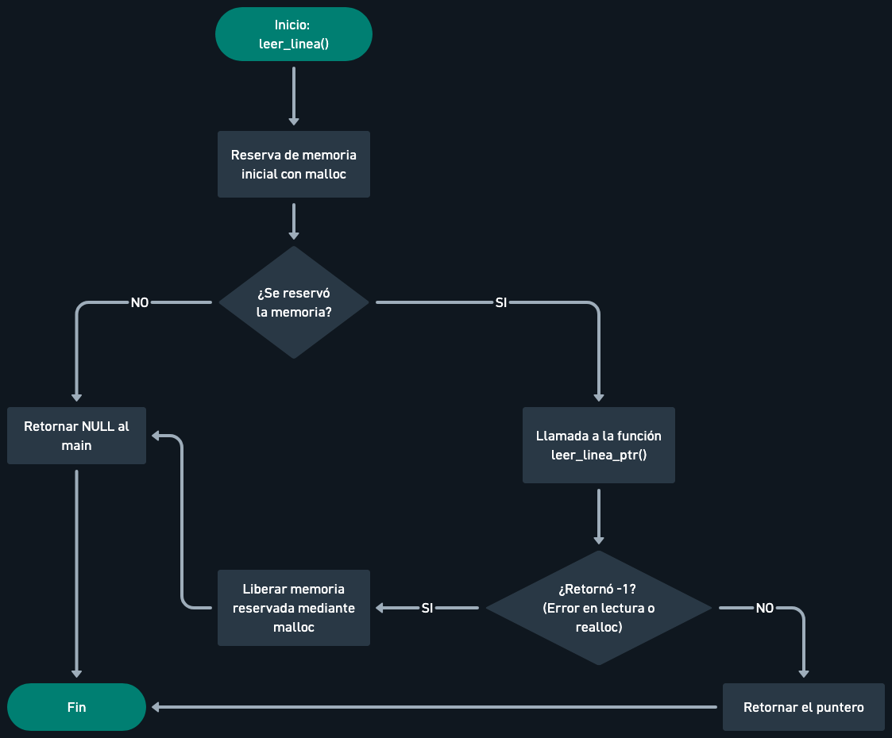
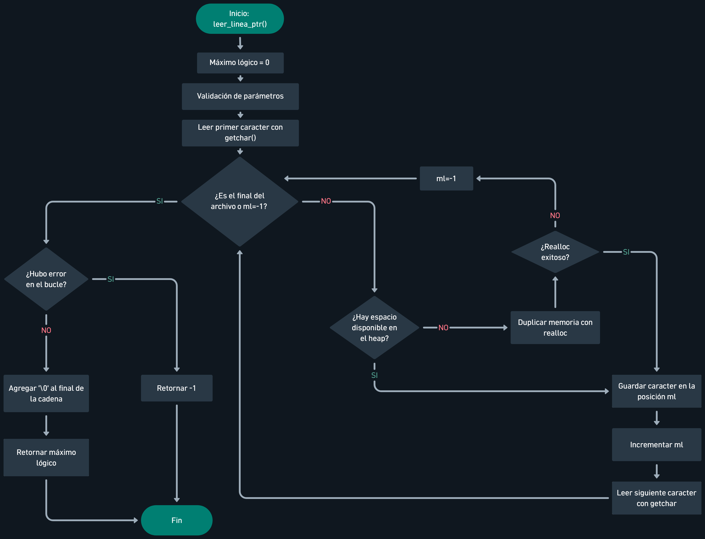
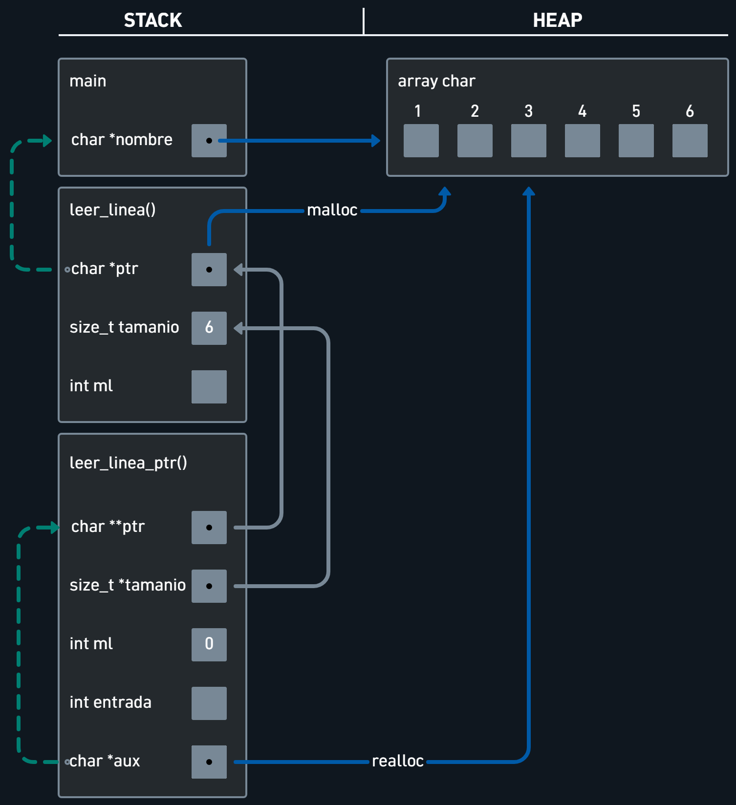

<div align="right">
    
</div>

# TP0

## Información del estudiante

* Arturo Guerra
* 115187
* aguerrab@fi.uba.ar
* arturoguerrab

## Índice
* [1. Instrucciones](#1-Instrucciones)
  * [1.1. Compilar el proyecto](#11-Compilar-el-proyecto)
  * [1.2. Ejecutar el programa con Valgrind](#12-Ejecutar-el-programa-con-Valgrind)
* [2. Funcionamiento](#2-Funcionamiento)
* [3. Estructura](#3-Estructura)
  * [3.1. Diagrama de memoria](#31-Diagrama-de-memoria)
* [4. Decisiones de diseño y/o complejidades de implementación](#4-Decisiones-de-diseño-yo-complejidades-de-implementación)
* [5. Respuestas a las preguntas teóricas](#5-Respuestas-a-las-preguntas-teóricas)

## 1. Instrucciones

### 1.1. Compilar el proyecto desde la carpeta TP0
```bash
gcc -std=c99 -Wall -Wconversion -Wtype-limits -pedantic -Werror -O2 -g src/*.c -o programa
```

### 1.2. Ejecutar el programa con Valgrind
```bash
valgrind --leak-check=full --track-origins=yes ./programa
```

## 2. Funcionamiento
El programa llama a la función leer_linea() desde el main, para realizar el ingreso dinámico de caracteres. Luego esta función se encarga de reservar un espacio dinámico en la memoria mediante la función malloc. Si el puntero resultante no es NULL (ya que malloc pudo reservar el espacio en memoria), procede a invocar a la función leer_linea_ptr(). La misma recibe la dirección de memoria del puntero reservado con malloc y a su vez el tamaño inicial reservado. Si el puntero es NULL directamente devuelve el NULL hacia el main.

Cuando se invoca a la función leer_linea_ptr(), se genera un while para que se pueda ir leyendo carácter a carácter desde el stdin mediante la función getchar(). Esto se realiza hasta que encuentre el EOF. Además, se establece como condición de salida el máximo lógico (ml) = -1, ya que este indicaría que hubo un error al reasignar memoria con el realloc.

Dentro del while, el carácter obtenido en cada iteración se va guardando en la dirección de memoria que corresponda según el máximo lógico y a este se le suma 1 en cada iteración. Si el máximo lógico llega al tope del espacio reservado, el realloc asigna el doble del espacio reservado actual para seguir con el ingreso de los caracteres restantes. Si el realloc fue exitoso se actualizan los parámetros, la dirección en memoria del puntero recibido y el tamaño del bloque de memoria reservado. Si el realloc tiene un error, devuelve el ml = -1 para salir del bucle. Una vez terminado el while sin errores, se asigna el '\0' en la posición ml para indicar el final de la cadena.

Las funciones free() para liberar la memoria se encuentran en el main, ya que este invoca a la función leer_linea() que libera la memoria luego de imprimir el nombre. En dicha función se encuentra otro free(), el cual libera la memoria solo si el realloc dentro de la otra función leer_linea_ptr() tiene un error, devolviendo -1.
<div align="center">
  
  <p>Diagrama de flujo de la funcion leer_linea()</p>
</div>
<div align="center">
  
  <p>Diagrama de flujo de la funcion leer_linea_ptr()</p>
</div>

## 3. Estructura
### Se implementaron 2 funciones.
La primera `leer_linea()` es invocada desde el main y la misma declara las variables:
- `*ptr`: almacena la dirección en memoria inicial que asigna malloc y será la retornada al main.
- `tamanio`: almacena el tamaño inicial de memoria que será `6*sizeof(char)`  
- `ml`: Es el máximo lógico de caracteres ingresados en la estructura dinámica y nos indicará si el proceso fue correcto o no, el dato se obtiene del retorno de la función `leer_linea_ptr()`.

La segunda función `leer_linea_ptr()` se invoca si el malloc fue exitoso y esta recibe como parámetros los punteros de las variables `*ptr` y `tamanio` declarados por la función anterior. Esta función declara las variables:

- `**ptr`: se recibe como parámetro, mediante esta, la función actualiza la dirección en memoria original con la nueva dirección asignada por el realloc, la misma se obtiene después de hacer la reasignación con la variable `*aux` si es una dirección de memoria no nula.
- `*tamanio`: se recibe como parámetro y apunta al tamaño de bloque de memoria original.
- `*aux`: variable auxiliar para guardar la dirección en memoria que asigne el realloc. Si es correcta, se hace la reasignación a la variable `**ptr` para actualizar la dirección en memoria original.
- `ml`: esta variable hará el conteo y el retorno de la cantidad de elementos almacenados en el vector.
- `entrada`: será la que reciba en cada iteración el carácter ingresado por el usuario.

### 3.1 Diagrama de memoria
<div align="center">
  
  <p>Diagrama de memoria de la estructura.</p>
</div>

## 4. Decisiones de diseño y/o complejidades de implementación

En el diseño implementé una estructura apegada al paradigma de programación estructurada. El mismo me permite manejar un orden estricto en el flujo del programa ya que todas las variables se declaran en la parte superior de cada bloque y se tiene un único punto de salida mediante un return al final de cada función.

La mayor complejidad del TP se encuentra en la función `leer_linea_ptr()` ya que la misma maneja la ampliación de memoria mediante el realloc. Debido a eso, decidí hacer una variable auxiliar que me permita detectar si el realloc tuvo algún error y así poder asignarle al máximo lógico el valor -1 que me permita salir del bucle indicando el error, además de no pisar la dirección de memoria original.

Para que esta función no fuera más compleja de lo que es, decidí manejar la liberación de memoria desde la función `leer_linea()` ya que la misma es la que reserva el bloque de memoria inicial en el heap. Si obtengo un error en la función de `leer_linea_ptr()` me permite liberar el espacio de memoria inicial o, si algún realloc generó una nueva dirección, liberar el bloque de memoria correspondiente.

## 5. Respuestas a las preguntas teóricas

### 5.1. Explicar cómo funcionan los strings en C
Debido a que los strings de forma nativa 'no existen' en C, los strings se generan mediante un vector de caracteres; el mismo debe de tener en la última posición de la cadena, como mínimo, el carácter nulo '\0', ya que así es como el lenguaje sabe dónde termina la misma.

### 5.2 Explicar el funcionamiento de las primitivas malloc y free.
La función `malloc()` reserva un espacio de memoria dinámica en el heap del tamaño que se le pase por parámetro. Si la función tuvo éxito, devuelve la dirección de memoria del primer byte del espacio reservado; de lo contrario devuelve NULL.

La función `free()` recibe como parámetro un puntero con la dirección de un espacio de memoria dinámica en el heap y permite liberarlo si ya el programa no necesita del mismo. La misma siempre debe utilizarse luego de una reserva de memoria en el heap para evitar pérdidas de memoria.
