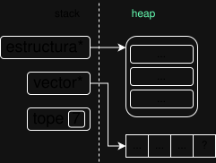

<div align="right">
    
</div>

# TP0

## Información del estudiante

* Arturo Guerra
* 115187
* aguerrab@fi.uba.ar
* arturoguerrab

## Índice
* [1. Instrucciones](#1-Instrucciones)
  * [1.1. Compilar el proyecto](#11-Compilar-el-proyecto)
  * [1.2. Ejecutar las pruebas](#12-Ejecutar-las-pruebas)
  * [1.3. Ejecutar el programa con Valgrind](#13-Ejecutar-el-programa-con-Valgrind)
* [2. Funcionamiento](#2-Funcionamiento)
* [3. Estructura](#3-Estructura)
  * [3.1. Diagrama de memoria](#31-Diagrama-de-memoria)
  * [3.2. Análisis de complejidades](#32-Análisis-de-complejidades)
* [4. Decisiones de diseño y/o complejidades de implementación](#4-Decisiones-de-diseño-yo-complejidades-de-implementación)
* [5. Respuestas a las preguntas teóricas](#5-Respuestas-a-las-preguntas-teóricas)

## 1. Instrucciones

> [!TIP]
> Se recomienda fuertemente crear y usar un Makefile y colocar en esta sección los comandos Make.

### 1.1. Compilar el proyecto
```bash
gcc -g -o programa  main.c leer_linea.c
```

### 1.2. Ejecutar el programa con Valgrind
```bash
valgrind --leak-check=full --track-origins=yes -s ./programa
```

## 2. Funcionamiento
Explicar **qué** hace el TP implementado, aclarando todas las decisiones de funcionamiento que no estaban definidas por el enunciado. Se deben incluir todos los diagramas que consideren necesarios para explicar el funcionamiento del programa.

> [!IMPORTANT]
> Es muy importante entender la *diferencia entre qué y cómo*. En esta sección **NO** se busca una explicación de cómo implementaste el programa, qué funciones usaste, en qué línea, etc.; se busca una explicación de **qué** es lo que hace el programa en líneas generales. 

> [!WARNING]
> Es importante usar diagramas para explicar los conceptos de forma clara, pero el exceso será negativo. Los diagramas deben tener un fin explicativo y, por lo general, sirven para reemplazar uno o múltiples párrafos de explicación.

## 2. Funcionamiento (EJEMPLO)
El programa llama a la funcion leer_linea() desde el main, para realizar el ingreso dinamico de caracteres. Luego esta funcion se encarga de reservar un espacio dinamico en la memoria mediante la funcion malloc. Si el puntero resultante no es NULL (ya que malloc pudo reservar el espacio en memoria), procede a invocar a la funcion leer_linea_ptr(). La misma recibe la direccion de memoria del puntero reservado con malloc y a su vez el tamaño inicial reservado. Si el puntero es NULL directamente devuelve el NULL hacia el main. 
Cuando se invoca a la funcion leer_linea_ptr(), se genera un while para que se pueda ir leyendo caracter a caracter desde el stdin mediante la funcion getchar(). Esto se realiza hasta que encuentre el '\n' ingresado por el usuario o encuentre el EOF. Ademas, se establece como condicion de salida el maximo logico (ml)=-1, ya que este indicaria que hubo un error al reasignar memoria con el realloc. 
Dentro del while, el caracter obtenido en cada iteracion se va guardando en la direccion de memoria que corresponda segun el maximo logico y a este se le suma 1 en cada iteracion. Si el maximo logico llega al tope del espacio reservado, el realloc asigna el doble del espacio reservado actual para seguir con el ingreso de los caracteres restantes. Si el realloc fue exitoso se actualizan los parametros, la direccion en memoria del puntero recibido y el tamaño del bloque de memoria reservado. Si el realloc tiene un error, devuelve el ml=-1 para salir del bucle. Una vez terminado el while sin errores, se asigna el '\0' en la posicion ml para indicar el final de la cadena. 
Las funciones free() para liberar la memoria se encuentran en el main, ya que este invoca a la funcion leer_linea() que libera la memoria luego de imprimir el nombre. En dicha funcion se encuentra otro free(), el cual libera la memoria solo si el realloc dentro de la otra funcion leer_linea_ptr() tiene un error, devolviendo -1.
<div align="center">
  
  <p>Diagrama de flujo de la funcion leer_linea()</p>
</div>

## 3. Estructura
Explicar cómo se implementó la/s estructura/s pedida/s en el [enunciado](./ENUNCIADO.md). En esta sección el objetivo es explicar en líneas generales, no técnicas, qué contiene la estructura, para qué y por qué.

## 3. Estructura (EJEMPLO)
Para implementar la estructura decidí hacerlo con un campo..., además tiene un puntero que... y eso permite que....

### 3.1. Diagrama de memoria
Realizar un diagrama de memoria de la estructura de memoria durante la ejecución del programa, esto debe incluir el stack y el heap con las estructuras contenidas en ellos.

### 3.1 Diagrama de memoria (EJEMPLO)
<div align="center">
  
  <p>Diagrama de memoria de la estructura.</p>
</div>


### 3.2. Análisis de complejidades
Explicar las complejidades computacionales de las primitvas implementadas en el TP (las funciones del .h) en notación Big-O, justificando por qué cada una tiene esa determinada complejidad.

### 3.2. Análisis de complejidades (EJEMPLO 1)

* `fun1` tiene una complejidad de $O(1)$ ya que tiene como parámetro... y, al leer una línea....
* `fun2` tiene una complejidad de $O(n)$ ya que tiene como parámetro..., la cual....
* `fun3` tiene una complejidad de $O(n^2)$ ya que tiene como parámetro... y se encarga de....

### 3.2. Análisis de complejidades (EJEMPLO 2)

|      Función      |Complejidad|                 Justificación                  |
|:-----------------:|:---------:|:----------------------------------------------:|
|      `fun1`       |  $O(1)$   |Tiene como parámetro... y, al leer una línea....|
|      `fun2`       |  $O(n)$   |Tiene como parámetro..., la cual....            |
|      `fun3`       |  $O(n^2)$ |Tiene como parámetro... y se encarga de....     |

## 4. Decisiones de diseño y/o complejidades de implementación
Explicar las decisiones de diseño y/o las complejidades de implementación que hubo durante la resolución del TP.

## 4. Decisiones de diseño y/o complejidades de implementación (EJEMPLO)
La mayor complejidad en el TP se encuentra en la función `foo` que requiere hacer...; es por esto que decidí.... Además, decidí que el programa haga... para mejorar la implementación.

## 5. Respuestas a las preguntas teóricas
Deberás incluir en esta sección las respuestas a las preguntas teóricas indicadas en el [enunciado](./ENUNCIADO.md) del TP.

## 5. Respuestas a las preguntas teóricas (EJEMPLO)

### 5.1. ¿Porqué...?
Respondido en su respectiva sección.

### 5.2 ¿Cómo...?
Para implementar el....

### 5.3 ¿Cuál fue el...?
El motivo fue....
